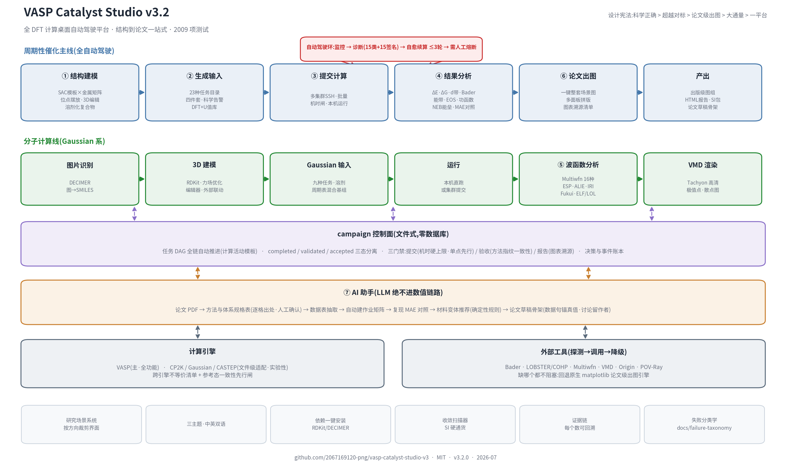

# VASP Catalyst Studio (vcstudio)

Desktop **full-DFT computing platform** with a managed pipeline — from
structure to paper in one place. Two workflow lines: a **periodic catalysis
main line** (SAC batch modeling → 23-type task catalog → multi-cluster
submission → failure diagnosis → bounded self-healing → ΔE/ΔG/electronic
structure/NEB analysis → one-click publication figure sets → reports & draft
manuscripts) and a **molecular line** (image→SMILES→3D→Gaussian→Multiwfn 16
analyses→VMD rendering), both running on a file-based campaign control plane
(task DAG, completed/validated/accepted three-state gates, method-fingerprint
consistency, compute-budget caps). Packaged as a single Windows EXE with a
deterministic zero-token core (LLM only in the optional assistant layer, never
in the numeric chain) and fully offline operation.

> 📂 Repository map: **[STRUCTURE.md](STRUCTURE.md)** ·
> 中文完整用法: **[使用说明.md](使用说明.md)** ·
> English guide: **[docs/user-guide-en.md](docs/user-guide-en.md)** ·
> MatClaw 式对话助手边界: **[docs/matclaw-integration.md](docs/matclaw-integration.md)** ·
> 开发进度/待办: **[docs/planning/progress-2026-07-16.md](docs/planning/progress-2026-07-16.md)**

## 软件流程图 · Workflow

双线工作流:**周期性催化主线**(①结构建模 → ②生成输入(23 种任务目录)→ ③提交计算 →
自动托管环(监控→诊断→续算≤3轮)→ ④结果分析 → ⑥论文出图 → 产出)与
**分子计算线**(图片识别 → 3D 建模 → Gaussian → ⑤波函数分析 → VMD 渲染),
共同跑在 **campaign 控制面**(任务 DAG/三态/三门禁)上,⑦AI 助手横贯全程但绝不进数值链路:



### 代码区块图(按流程分块,方便按需求查代码)

| 流程区块 | 代码包 | 负责什么 | 关键文件 |
|---|---|---|---|
| ① 生成 Generate | `vcstudio/generate/` | POSCAR+用户INCAR → 校验补全四件套(缺项才补,不改用户键) | `job_builder.py` `incar_builder.py` `kpoints.py`(倒格矢) `potcar.py` `poscar.py` |
| ② 提交 Submit | `vcstudio/cluster/` | PBS/Slurm 双方言、preflight、SSH 上传+提交 | `schedulers.py` `script_builder.py` `submitter.py` `connection.py` |
| ③ 监控+诊断 Monitor | `vcstudio/cluster/` | 查队列判排队/运行/终态 → 取证 → 15 类作业分类 + 15 条 VASP 错误签名([失败分类表](docs/failure-taxonomy.md));**续算沉降护栏** | `submitter.refresh_job` `diagnose.py` `convergence.py` |
| ④ 有界恢复 Recovery | `vcstudio/cluster/` | CONTCAR/改参续算(≤3轮,INCAR 冻结),否则交人工 | `submitter.continue_from_contcar` `batch_ops.py` |
| ⑤ 分析+报告 Analyze | `vcstudio/project/` + `external/` | ΔE 门控、吸附能/ΔG台阶/d带中心/Bader、论文级出图、HTML 预览+DOCX+PDF 同源报告 | `adsorption.py` `freeenergy.py` `thermo.py` `dosparse.py` `bader.py` `charts.py` `report_documents.py` `external/native_charts.py` |
| ⑥ 结构生成 StructGen (v3.1) | `vcstudio/generate/` | SAC 模板库(六类配位×金属矩阵)、LiPS 分子库、吸附位点枚举与摆放、参考态注册 | `sac_builder.py` `molecules.py` `sites.py` `project/references.py` |
| ⑦ 派生计算 Derived (v3.1) | `vcstudio/generate/` + `project/` | 弛豫→频率(ZPE/熵)/电子结构静态(PDOS/Bader/差分电荷)一键派生;多自旋并跑;虚频质量闸 | `freq_builder.py` `estatic.py` `spin_scan.py` `chgdiff.py` |
| ⑧ 通用 CHE 引擎 (v3.1) | `vcstudio/project/` | 反应网络预设(Li-S 16e/缔合解离/ORR/HER/OER/CO2RR),U_eq/U_L/η,多电位台阶 | `reactions.py` `freeenergy.free_energy_path` |
| ⑨ campaign 控制面 (v3.1) | `vcstudio/campaign/` | 文件式任务 DAG:三态(completed/validated/accepted)、三门禁(提交/验收/报告)、方法指纹、决策账本、机时预算闸 | `schema.py` `states.py` `gates.py` `fingerprint.py` `ledger.py` `budget.py` `derive.py` |
| 跨层基础 Shared | `vcstudio/shared/` | 配置、清单(job.yaml状态机)、凭据(keyring) | `config.py` `manifest.py` `secrets.py` |
| ⑩ 分子线 Molecular (v3.1.1) | `vcstudio/molbuild/` + `external/` | 图片识别(DECIMER)/SMILES→3D(RDKit)/外部编辑器联动;Multiwfn 16 种分析/VMD Tachyon 渲染/本机运行器 | `ocsr.py` `smiles3d.py` `multiwfn_driver.py` `vmd_driver.py` `cluster/local_runner.py` |
| ⑪ 全 DFT 目录 TaskCatalog (v3.2) | `vcstudio/generate/` + `project/` | 23 种计算类型五分类:收敛扫描/能带/EOS/功函数/表面能/Dimer/VASPsol/DFT+U 值库 | `task_catalog.py` `conv_scan.py` `bands_builder.py` `eos.py` `workfunction.py` `u_library.py` |
| ⑫ 一键出图与 AI Pipeline (v3.2) | `vcstudio/project/` | 场景感知整套图+多面板拼版+图表溯源;计算活动模板全链推进;论文数据抽取→MAE 对照→变体推荐→论文草稿骨架 | `auto_figures.py` `panel_composer.py` `campaign_templates.py` `paper_data.py` `variant_advisor.py` `manuscript_draft.py` |
| 多引擎 Engines (v3.1.1) | `vcstudio/engines/` | CalcSpec IR + VASP/CP2K/Gaussian/CASTEP 文件级后端;跨引擎不等价清单+参考态一致性闸 | `calcspec.py` `gaussian.py` `cp2k.py` `castep.py` `equivalence.py` |
| 界面 GUI | `vcstudio/gui_web/`(默认 Web)+ `gui/`(旧 tkinter) | pywebview 前端 + `api.py` 薄门面;工作流式九页，以及带会话、附件、状态与停止功能的 MatClaw 式对话入口 | `gui_web/api.py` `gui_web/pipeline_supervisor.py` `project/assistant_chat.py` `assets/*.js` |

## Statement of need

Graduate-student catalysis screening lives between two worlds that existing
tools serve poorly: terminal pre/post-processors (VASPKIT, qvasp) leave
cluster orchestration to hand-written bash, while workflow infrastructures
(AiiDA, atomate2, pyiron) assume a server/database mindset and a Python-first
user. LLM-agent frameworks (VASPilot, AutoDFT) automate decisions but require
online inference in the loop. vcstudio targets the gap: a zero-install desktop
tool that drives double-hop PBS/Slurm clusters, refuses to guess (explicit
state machine, bounded self-healing, NEEDS_HUMAN stops), intercepts geometry
errors *before* they burn cluster time, and generates Methods paragraphs
guaranteed consistent with the actual INCAR/KPOINTS/POTCAR. See the full
[feature comparison with published tools](docs/comparison.md).

## Features

| Layer | Module | What it does |
|---|---|---|
| Generate | `vcstudio/generate/` | POSCAR + your INCAR → validated 4-file input set; completes only missing keys, **never overwrites yours**; `job.yaml` records sha256 provenance |
| Submit | `cluster/{schedulers,script_builder,submitter,connection}` | PBS/Slurm dialects (pure functions); preflight gates; dual-track scripts (auto / your template passed through verbatim) |
| Monitor + diagnose | `submitter.refresh_job` + `cluster/diagnose.py` | scheduler exit reason + output integrity + log signatures + convergence + energy sanity → 15 job-classification outcomes + 15 VASP internal-error signatures → 4 terminal states ([taxonomy](docs/failure-taxonomy.md)) |
| Bounded recovery | `submitter.continue_from_contcar` | only for recoverable classes; CONTCAR validated; INCAR frozen; **max 3 rounds**; anything else → NEEDS_HUMAN |
| Analyze + report | `project/` + `external/` | ΔE gating (all-DONE before numbers), Li–S discharge path (ΔG/PDS/U_L), Origin/SVG dual chart engines, POV-Ray structure figures, one data model rendered as HTML preview + DOCX + PDF, bilingual LLM analysis (real INCAR injected, no fabricated citations) |
| Publication aids | `cluster/convergence.py`, `generate/structure_view.py`, `generate/methods_text.py`, `project/dosparse.py` | per-ionic-step convergence charts; 3D structure preview with molecule–slab clash interception; bilingual Methods + BibTeX from real inputs; total-DOS SVG from vasprun.xml |

Three invariants: ① methodology sovereignty (your INCAR/template is passed
through verbatim) ② deterministic core is zero-token ③ explicit state, never
silent (job.yaml state machine + audit history).

## 2026-07-16 更新(本轮进展)

- **修复续算状态误识别**:续算重投后新作业尚未进调度器队列时,不再拿上一轮旧
  OUTCAR 误判为"已完成/需续算/SCF 震荡",而是保持 SUBMITTED 视作仍在排队
  (续算沉降护栏,PBS/Slurm 均覆盖,含回归测试)。
- **原生论文级出图引擎** `external/native_charts.py`:纯 matplotlib 达论文质量
  (serif/矢量 PDF/多面板/色盲安全色板),不依赖 Origin/POV-Ray。吸附能分组柱状图、
  数据矩阵表、ΔG 自由能台阶图、**多催化剂热图**、**火山图**(自动求 Sabatier 峰顶)、
  标度关系图。**已接入 GUI**:项目页「论文级出图」卡片,勾选图类型一键生成
  (单项目:柱状图/表/台阶图;多项目对比:热图/标度关系/火山图),生成后自动打开
  图目录。打包默认收录 matplotlib(`--no-charts` 可关)。
- **结果分析增强**:PDOS 投影 + d 带中心、Bader 电荷解析、可选 ΔG 口径
  (默认 ZPE−TS 对齐文献 / 可切 ASE 严格式含振动内能项)、PDS/U_L 图数一致性。
- **输入正确性**:KPOINTS 改用倒格矢(修六方/hcp slab 欠采样)、项目内 ENCUT 强制
  统一(保吸附能 ΔE 各成员基组一致)、计算类型下拉(修 web 硬编码 slab)。
- **诊断扩展**:磁盘满/IO 错误、裸退出码 137 降级为疑墙钟(可续算,不再困死)、
  ZBRENT 扩展签名。
- **界面**:任务页按吸附能项目组归并折叠(整组进度)、dashboard 首页落地。
- **工程化**:config 脱敏(移除内网 IP)、版本号单一事实来源、依赖分组声明、
  CI 加 lint+覆盖率+打包冒烟。

全套 525 测试通过(2 项在无 OriginLab/POV-Ray 时跳过)。下一步待办见 **[docs/planning/progress-2026-07-16.md](docs/planning/progress-2026-07-16.md)**。

## 2026-07-17 更新:v3.1 Phase A —— DFT 全通量管线地基(引擎层)

依据 **[v3.1 总体方案](docs/planning/v3.1-总体方案.md)**(68 个调研 Agent 合成,验收基准=完整复现一篇 SAC 锂硫论文的 32 图 6 表,设计宪法:科学正确 > 超越对标 > 论文级出图 > 大通量 > 一平台),本轮落地 Phase A 引擎层(+363 测试):

- **campaign 文件式控制面** `vcstudio/campaign/`:任务 DAG(YAML/JSONL 即事实源,零数据库)、
  **completed/validated/accepted 三态分离**(只有 accepted 进图表报告;AI/外部无权直写 accepted)、
  三门禁(提交门=机时硬上限+单点先行;验收门=方法指纹一致性;报告门=图表溯源完备)、
  方法指纹对象(一次 ΔE 比较所有能量必须同指纹→可复现包"一致性证书")、
  append-only 决策/事件账本(写入前拦密钥)、机时预算账本、单机锁(过期只报不抢占)
- **频率生成端 + 虚频质量闸** `generate/freq_builder.py` + `thermo.classify_imaginary`:
  从完成弛豫一键派生 IBRION=5 频率作业(只放开吸附质+近邻,派生改动逐条留痕);
  虚频四象限分类(噪声/坏极小点/合法TS/非法TS),不可用者绝不静默进 ΔG——
  纯 ΔE 升级为**论文级 ΔG** 的最后一块拼图
- **多自旋并跑 + 磁矩守卫** `project/spin_scan.py`:非磁/低自旋/高自旋初猜族并行弛豫取基态
  (自旋误判可致 ΔE 偏差 >0.5 eV),末态磁矩审计(塌零/翻转告警),电子熵超标守卫
- **电子结构分析链**:vasprun **partial DOS 流式解析** + 自旋分辨 **d 带中心**(积分窗口显式)
  + d-p 杂化重叠;**Bader 全链**(AECCAR 合参考→bader 调用→ΔQ+守恒校验,未装则降级说明);
  **差分电荷工作流**(吸附态自动拆 AB/A/B 冻结几何三单点→网格代数→VESTA 可读 CHGDIFF.vasp
  +面平均 Δρ(z));`generate/estatic.py` 从弛豫一键派生 PDOS/Bader/差分电荷静态作业;
  出版级 `pdos_plot`(自旋镜像+εd 标线)与 `charge_profile_plot`
- **SAC 结构生成入口** `generate/{sac_builder,molecules,sites}.py` + `project/references.py`:
  石墨烯超胞+六类配位模板(MN4/MN3/MP1N3/MS1N3/MB1N3/MN4+B)×任意金属矩阵批量建模;
  15 种分子库(S8/Li2Sn/LiS 开壳/DOL/DME/参考小分子)+大盒装箱;SAC 语义位点枚举
  +吸附质双端启发摆放+取向采样(过近拒绝);参考态注册缓存(口径指纹守卫)
  +Eb/Ecoh 稳定性红绿灯
- **通用 CHE/ΔG 台阶引擎** `project/reactions.py` + `freeenergy.free_energy_path`:
  Li-S 硬编码抽象为"物种链+电子数+参比电对"通用引擎,8 组预设
  (Li-S 16e/论文缔合×2/解离/ORR/HER/OER/CO2RR),逐步质量-电荷守恒校验,
  U_eq/U_L/η,多电位台阶(U=0/U_eq/U_L 三线),U_eq 与实验区间对照告警
- **术语统一**(中文文案审查落地):组态→构型(58 处)、任务→作业、需人工统一、
  限制电位步口径说明等,为 i18n 中英双语铺路

933 测试通过(2 跳过)。

## v3.1.0 正式发布(2026-07-17)· Phase B+C 全部落地

**下载**:[Releases 页](https://github.com/2067169120-png/vasp-catalyst-studio-v3/releases) 提供 Windows 单文件 EXE(标签推送后由 CI 自动构建)。

**界面重构(starpivot 式工作流)**:编号步进侧栏 概览 → ①结构建模 → ②生成输入 → ③提交计算 → ④结果分析 → ⑤论文出图 → ⑥AI 助手;研究场景系统按方向裁剪界面;三主题;中英双语基础;结构查看/编辑器(3Dmol 交互:选中/移动/删除/改元素/固定底层/真空检查/导出 POSCAR);图表预设画廊(12 图型点选出图);AI 助手页(论文→规格表→计划→实例化,全自动开关受机时闸/单点先行/三态门禁约束)。

**Phase B**:GUI 派生按钮(频率/PDOS/Bader/差分电荷)、SAC 候选矩阵页(chips 选金属×模板×吸附质,预估机时,自动建项目+campaign)、多自旋并跑与对比、通用反应预设下拉;**CI-NEB 全流程**(插值→多 image 作业→逐 image 监控→能垒+MEP 图);**COHP/LOBSTER 链**(lobsterin 生成/解析/spilling 质量闸);筛选引擎(描述符汇总+火山图双支自动拟合)。

**Phase C**:收尾流水线(Methods 成段/SI 装订/三线表/口径稽核,只组织真实数据);AI 论文入口(逐格出处的规格表,LLM 不进数值链路);**多引擎适配层**(CalcSpec IR + CP2K/Gaussian/CASTEP 文件级后端 + 跨引擎不等价清单 + 参考态一致性先行闸;引擎软件用户自备);场景系统与 i18n。

**1401 测试通过(3 跳过)**。完整清单见 [CHANGELOG.md](CHANGELOG.md);路线图与验证计划见 [v3.1 总体方案](docs/planning/v3.1-总体方案.md)(端到端复现文献 MAE 表为下一步验证项)。

### v3.1.1(2026-07-18):分子计算全流程

对齐 starpivot-DFT 全部功能与选项并超越:图片识别(DECIMER)→SMILES→RDKit 3D 建模→Gaussian 输入(九种任务/溶剂模型/周期表混合基组 Gen-GenECP/资源行)→批量提交(任意输入文件/筛选排序/勾选批量取消/**本机运行**)→**波函数分析八件套**(ESP/ALIE/HOMO-LUMO/IGMH/NCI-RDG/IRI/AIM,Multiwfn 本机/远程)→**VMD 一键可视化**(Tachyon 渲染/极值点标注);编辑器样式视角测量原子表;AIMD 派生;远端文件管理。工作流侧栏更新为 ①结构建模→②生成输入→③提交计算→④结果分析→⑤波函数分析→⑥论文出图→⑦AI助手。**1704 测试通过(6 跳过)**。

### v3.2.0(2026-07-18):全 DFT 计算平台

**23 种计算类型目录**(收敛扫描/能带/EOS/功函数/表面能/Dimer/VASPsol/DFT+U 值库等全补齐,选类型→派生→解析→出图闭环);**一键出图管线**(自动托管终点场景感知整套图+多面板拼版+图表溯源,计算活动模板全链自动推进);**AI 数据闭环**(论文数据表抽取→复现 MAE 自动对照→变体矩阵推荐→论文草稿骨架);starpivot 细节对齐(精确依赖检测与可复制安装命令/核时四卡/波函数 16 种/Fukui·ELF-LOL·散点图)。**2051 测试通过(6 跳过)**。

### 2026-07-20：本地结果导入、VASP 主链与多引擎适配

- 结果分析页可递归导入一个完整文件夹；仅有 `CONTCAR/OSZICAR/OUTCAR/vasprun.xml`
  的已算结果也能按多证据收敛门槛识别，不要求它原先属于集群台账。
- Li-S 向导复用已导入的分子参考能：clean slab 与每个 adsorption 目录分别读取自己的
  `POSCAR + INCAR` 并自动补齐四件套；用户选择服务器、核数和墙时后可整组提交。
- 自动托管在软件保持运行时监控、最多续算 3 轮、下载关键结果，并在整组完成后
  自动计算吸附能和生成报告。
- 依赖入口改为“检测 → 推荐勾选 → 复制可直接执行的 PowerShell/终端命令 → 重新检测”。
  冻结 EXE 不再把自身误当 Python 启动；完整版 EXE 的图表与 RDKit 能力在打包时内置。
- 设置页顶部新增“工作模式 + 本次计算类型”：常用模式为 Li-S 吸附能、通用 VASP、
  分子计算和专家模式。选择后导航、计算引擎、任务目录和专用表单会同步裁剪，只保留
  本次需要的入口；23 种 DFT 类型都具备可到达的生成器、计算器或专用流程。
- 通用 DFT 派生作业统一写标准 `job.yaml`，不再把未知任务静默当作弛豫；提交、状态判定
  和默认结果下载按任务类型选择输入/产物，能带、Bader、ELF、功函数、AIMD 等不会再漏文件。
- 任务页可一次刷新所有已配置服务器上的活动作业。每台服务器独立使用自己的凭据、队列
  方言、远端目录和引擎命令；单台连接失败不会阻塞其它服务器的监控结果。
- 远程操作新增服务器归属硬闸：下载、续算、取消不能跨服务器；已提交/DONE 作业不能重复
  提交；同批远端目录冲突在联网前整批阻止。结果下载采用临时文件完成后原子替换，中断时
  不会截断本地已有结果。
- Gaussian、CP2K、CASTEP 输入生成后直接写标准清单并入台账，可走提交、监控、任务类型下载、
  引擎原生能量解析和带文件指纹报告；不会再误读 VASP 的 `OSZICAR`。
- VASPsol 改为一次派生同几何真空/溶剂双作业；只有两者均 DONE、方法/几何一致且溶剂
  `OUTCAR` 能证明 VASPsol 补丁生效时，才计算 `E_sol−E_vac` 并生成报告。
- NEB 会把真实端点能量文件及 SHA256 带入 `00`/末态，Bader 在没有 `ACF.dat` 时只显示
  产物证据和下一步，不再假称已完成自动解析。表面能、形成/结合能、差分电荷和多自旋比较
  都会生成专用可追溯报告；大数相减前强制 DONE/完整页脚/方法一致性门槛。
- VASP 结构层统一支持 POSCAR/CONTCAR/CHGCAR/LOCPOT 的单一正缩放、负值目标体积和
  三分量缩放；预览、差分电荷、功函数、EOS、POV-Ray 与结果导入使用同一几何口径。
- VASP 任务完成判定按 relax/static/freq/AIMD/NEB 分开，并强制干净结束页脚；派生的
  静态、频率、能带和收敛扫描会清理父作业的续算/离子步状态。`ICHARG=1/11`
  会在联网前强制要求 `CHGCAR`，能带回收包含 `PROCAR`；NEB 未实现 image 级安全续算时明确交人工。
- 设置页与生成页共用唯一的“工作模式 → 计算引擎 → 本次任务”状态。VASP 默认显示完整流程；
  CP2K/Gaussian/CASTEP 只显示已闭环的任务和引擎原生单位，后端用同一能力白名单再校验。
- CP2K 补齐 Ry 截断、k 点、Selective Dynamics、RPBE/PBEsol XC 和频率/末结构；Gaussian 补齐
  GD3/GD3BJ、任务级完成、MP2/CC/热校正与末结构；CASTEP 补齐 D3/D3-BJ、0 K 能量口径、
  `.phonon/.geom` 和同 seed 输入门。所有非 VASP 失败/未收敛能量只记为 raw，不进入可信结果。
- 上一轮回归基线：**2543 测试通过，8 项按本机可选软件/依赖环境跳过**。

### 2026-07-21：批量吸附能智能分组与可信自动托管

- 新计算扫描会把每个结构绑定到同目录唯一的 `INCAR`，不同目录多份 INCAR 不再视为歧义；
  本地文件优先，显式备用只补真正缺失的目录，不会掩盖空文件、大小写冲突或非法参数。
  同目录完整 `POSCAR/INCAR/KPOINTS/POTCAR` 会字节级复制；不完整目录只用本目录
  `POSCAR+INCAR` 生成受管四件套，不改源文件。生成、manifest 和 SSH 上传均逐成员保留
  源路径与 SHA256；上传前会再次核对最终四件套，准备后被修改的成员必须重新准备。
  物种分组仍只由结构组成决定。
- 新计算目录优先读取 `POSCAR`，已算结果优先读取 `CONTCAR`；以
  `composition(config) − composition(clean slab)` 识别吸附物化学计量，按组成稳定分组。
  文件夹名只作提示；同组成多参考、无法唯一识别或人工改映射时必须确认并留审计记录。
- 检查拆成两层：提交门只检查每个目录自身能否运行（四件套、POSCAR/POTCAR 顺序、合法
  `ISPIN`、本目录 `MAGMOM`/DFT+U 向量等）；跨目录方法差异只影响自动 ΔE/报告。
  `NSW/IBRION/MAGMOM` 不要求跨作业相同；分子参考、clean slab、adsorption 可按各自基态
  使用 `ISPIN=1/2`，包括吸附诱导磁性的 clean=1、adsorption=2，只作核对提示而不阻止提交。
- 智能修复先展示哈希绑定的预览并等待选择；当前只会把受管副本的 `ENCUT` 安全上调到组内
  最大值，保留修复前备份和前后 SHA256。`MAGMOM` 等磁性选择只给候选建议，绝不自动改写；
  源目录始终只读，预览后任一实际使用的输入发生变化都必须重新确认。
- 自动托管只操作项目提交成功后保存的目录白名单。多服务器并行隔离；服务器端点指纹、
  per-job 互斥和下载代次 CAS 防止同名服务器接管、双重续算或旧清单覆盖新作业号。
- 续算前把上一轮输出移入远端历史目录；重投失败会恢复输出、INCAR/POSCAR。最终下载只接受
  DONE，证据绑定 job id、remote dir、attempt token、文件大小与 SHA256，运行中预览不能冒充最终结果。
- ΔE 的 slab/config/reference 每个操作数都要通过 DONE、完整结束页脚和当前 `OSZICAR:E0`
  复核。已知的泛函、ENCUT、共享元素 POTCAR/DFT+U 冲突会暂停相减；关键方法证据缺失时
  标为 unverified。无参考态、参考无效或未确认的方法差异只能生成诊断，不能标记为最终
  吸附能报告。
  报告绑定成员代次、能量、下载哈希与方法证据；结果变化或报告文件删除后会自动失效重建。
- 该轮历史回归基线：**2695 测试通过，6 项按本机可选软件/依赖环境跳过**。

### 2026-07-23：论文式报告、后台主管与对话助手

- 项目报告改为同一份结构化数据同时写出 **HTML 预览、DOCX 和 PDF**。正文采用更接近
  成熟论文的版式，表格、图片、方法证据和溯源信息在三种载体中保持同一口径；图像资源会
  复制到报告目录后再引用，数据盘与报告盘不同也不依赖跨盘相对路径。
- 吸附能图自动缩短并错开长构型标签；自由能台阶图分离 PDS 与限制电位标注。多个催化剂
  项目统一按同一物种顺序比较，**5 组以上仍叠加在同一张台阶图**，用颜色、线型、标记和
  图外图例区分，而不是擅自拆成小图。
- 自动托管的调度从浏览器定时器移到应用内 Python 主管线程。只要应用进程仍在运行，
  页面切换不会中断监控；界面可读取运行/暂停、上次与下次检查、续算轮次、阻塞原因和
  报告状态。结果达到最终门后自动生成完整报告；证据不足时只生成诊断报告。
- AI 助手新增受 [MatClaw](https://github.com/DingyangLyu/MatClaw) 启发的对话入口：
  支持本地会话恢复、受限附件、只读状态和停止当前 AI 响应，同时复用 vcstudio 已有的
  科学门禁。它不嵌入 Node/Docker/Claude SDK，不开放任意 shell，也不能通过 `/stop`
  取消 HPC 作业。审计提交、许可证与安全边界见
  [MatClaw 集成说明](docs/matclaw-integration.md)。
- 本节不预写尚未完成的最终测试数字；当前分支的实际基线以
  `python -m pytest` 和 CI 输出为准。

### 2026-07-24：候选评价与多催化剂批次报告

- 项目结果区给出可审计的四级候选结论：**建议继续 / 先补证据 / 降低优先级 /
  阻止判断**。Li-S Sabatier 初筛同时检查长链锚定、短链过强和 Li₂S 产物陷阱；
  不把“吸附越负”误写成“催化越好”，也不替代自由能、溶剂化和 NEB。
- 多项目选择会持久保存。每个催化剂按规范物种选最稳构型，`5` 组以上仍在同一张
  自由能台阶图比较；颜色、线型和标记联合编码，长名称图例置于图外并自动换行。
- 台阶图只叠加反应步骤、参比和自由能修正口径一致的路径。`PDS` 与 `U_L` 直接采用
  自由能引擎结果；普通 Li₂Sₓ 电子吸附能不能冒充火山图自由能描述符。
- 单项目和批次报告从冻结数据模型生成 **HTML + Word + PDF**，采用 A4、三线表、
  图表题注和页眉页码。图片按内容哈希收进报告资源包，支持数据盘与报告盘不同。

## Install & quickstart

**GUI (Windows)**: double-click `dist\VASP Catalyst Studio.exe`
(web UI default; `--legacy` starts the Tkinter fallback).

**Library + CLI**:

```bash
pip install -e .[dev]
vcs gen --poscar POSCAR --incar my.incar --calc-type slab -o results/job1/
```

**Try it offline in 5 minutes** (no cluster, no licensed POTCARs needed):
[examples/quickstart](examples/quickstart/README.md) — includes a fake demo
POTCAR library generator (real pseudopotentials are licensed material and are
never distributed with this repository).

**Verify the analysis chain offline** (diagnose → gated ΔE → chart →
HTML/DOCX/PDF report bundle, no VASP or cluster):
[examples/offline_analysis](examples/offline_analysis/README.md)
— `python examples/offline_analysis/run_demo.py` drives a synthetic completed
job set end-to-end so a reviewer can confirm the analysis half of the pipeline.

**Tests**: run `python -m pytest`; the command and CI are the source of truth for
the current branch's pass/skip counts. Optional OriginLab smoke tests remain behind
`VCS_ORIGIN_SMOKE=1`, and POV-Ray real-render checks depend on the local executable.
Parser cross-checks against ASE run when `ase` is installed (in the `dev` extra).
CI runs the suite on ubuntu/windows × Python 3.10/3.12.

## Scientific conventions

- `E_ads = E(slab+ads) − E(slab) − E(ref)`; negative = favorable adsorption
- `μ_Li = (E(Li₂S) − E(S₈)/8) / 2`; discharge path ΔG referenced to S8* = 0;
  `U_L = −max(ΔG/Δn_e)` (computational hydrogen electrode)
- All energies are DFT electronic energies (no ZPE/entropy) — stated
  explicitly in reports and in AI prompts
- Validation protocol (Montoya-style MAE vs independent references):
  [docs/validation.md](docs/validation.md)
- Credentials (cluster passwords / LLM keys) go to the Windows Credential
  Manager only — never to plain text

## Contributing & citing

See [CONTRIBUTING.md](CONTRIBUTING.md). If you use this software, please cite
via [CITATION.cff](CITATION.cff). Licensed under [MIT](LICENSE).

---

## 中文速览

全 DFT 计算桌面自动托管平台:从结构到论文一站式。周期性催化主线(SAC 批量建模 →
23 种计算类型 → 多集群提交 → 诊断自愈 → ΔE/ΔG/电子结构/NEB → 一键整套论文图 →
报告与论文骨架)+ 分子线(图片识别 → 3D 建模 → Gaussian → Multiwfn 波函数 16 种 →
VMD 渲染),跑在 campaign 控制面上(任务 DAG/三态门禁/方法指纹/机时闸)。
Windows 单文件 EXE,确定性核心零 token,AI 只做助手绝不进数值链路,全离线运行。

- **快速开始**:从 [Releases](https://github.com/2067169120-png/vasp-catalyst-studio-v3/releases)
  下载 EXE 双击即用(工作流九页:概览/①结构建模/②生成输入/③提交计算/④结果分析/
  ⑤波函数分析/⑥论文出图/⑦AI助手/集群/设置;命令行 `vcs gui`,`--legacy` 旧 tkinter);
  改完代码双击 `重新打包EXE.bat` 重打包
- **离线体验**:[examples/quickstart](examples/quickstart/README.md)
  (石墨烯示例+假赝势库,五分钟跑通全链);
  [examples/offline_analysis](examples/offline_analysis/README.md)
  (合成的已完成作业 → 诊断/ΔE/出图/报告,审稿人无 VASP/集群即可验证分析链路)
- **完整用法**:[使用说明.md](使用说明.md);目录结构:[STRUCTURE.md](STRUCTURE.md)
- **测试**:`python -m pytest`；当前分支的通过/跳过数以命令输出和 CI 为准
- **科学约定/发刊工具链**:同上英文节;竞品对比见
  [docs/comparison.md](docs/comparison.md),验证协议见
  [docs/validation.md](docs/validation.md)

```
vcstudio/       核心包(generate/cluster/project/external/engines/molbuild/campaign/gui_web/shared/cli)
tests/          回归测试   docs/superpowers/specs/  设计文档
config.example.yaml  配置模板(复制为 config.yaml 填写;config.yaml 已 gitignore)
dist/           打包产物 EXE(gitignore)   results/  作业输出(不入 git)
```
