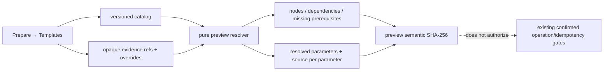

# 催化领域合同、研究配方与执行前 DAG

状态：实现合同 v2（2026-08-15）。本文描述逻辑研究层，不改变作业执行事实源、远程提交门禁或报告发布门禁。

## 1. 分层与事实边界

本功能包把“为什么做、准备做什么”与“实际执行过什么”分开：

| 层 | 记录内容 | 权威边界 |
|---|---|---|
| 催化领域 DTO | surface、adsorbate state、elementary step、conditions、reaction network | 科学对象、不可变 revision 和逻辑关系；不记录浏览器路径、命令、主机或密钥 |
| WorkflowRecipe | 有版本的节点、依赖、输入证据、参数、输出、科学限制、官方参考 | 研究意图；`ready` 只表示预览前置齐全 |
| WorkflowRunSnapshot | 固定 recipe ID/version/hash、完整 resolved parameters、每项参数来源和 preview hash | 可能运行的冻结计划；`authorizes_execution=false` |
| `job.yaml` | 已创建/已执行作业的输入、状态和尝试 | **唯一作业事实源**；本包不覆盖、不旁路 |

这一分层借鉴 AiiDA 对 data provenance 与 logical provenance 的区分，但实现是 VASP Catalyst Studio 自有的轻量 DTO；没有引入或嵌入 AiiDA。

## 2. 严格 DTO 与存储合同

实现位于 `vcstudio/project/catalysis_contracts.py`。

- `CatalystSurface`：composition、Miller index、termination opaque ID、`geometric_site_ids`。合同故意没有可由几何位点自动推出的 active-site 字段。
- `AdsorbateState`：surface/adsorbate/state opaque IDs、formula、几何位点、charge/multiplicity。
- `ElementaryStep` v3：reactants、非空 transition-state、products 三侧均为 participant tuple。每个 participant 显式携带 `state_id`、规范 `{numerator, denominator}` 精确有理系数、phase、charge，以及按 site type 分解的有理 `site_stoichiometry`。v1 的 state-ID 数组和 v2 的整数系数、标量 `site_count`、裸 `transition_state_id` 都会 fail closed；缺失权威信息时不做无证据迁移。
- `ConditionSet`：temperature、pressure、pH、电极电势；至少一项有定义。
- `ReactionNetwork`：仅以 opaque IDs 连接 surfaces、states、steps 和 conditions。
- `WorkflowRecipe`：版本、双语元数据、输入槽、参数、拓扑有序节点、科学限制和 HTTPS 官方参考。

除另有独立 recipe version 的 `WorkflowRecipe` 外，所有领域对象都必须携带：

1. DTO 形状的 `schema_version`；
2. 不可变 `object_revision_id`；后续 revision 同时携带 `parent_revision` 与 `expected_current_hash`；
3. 显式 `provenance ∈ {observed, imported, inferred}`；
4. `EvidenceRef[]`，每条含 evidence type、opaque ID、origin 和可选 revision ID；
5. `MethodFingerprint`，含 method opaque ID、scope、SHA-256 和方法证据引用。

观测对象只能引用 `origin=observed` 的证据；推断对象必须至少有一条 `origin=inferred` 证据。合同会拒绝同一 DTO 内部 top-level provenance 与 evidence/method origin 的不一致，也会拒绝把 `publication_record` / `imported_record` 标成 observed。origin 本身仍是调用方声明，当前没有 authoritative evidence resolver 或签名，因此该一致性检查不能证明来源真实性。`DomainEnvelope` v2 对 DTO 重解析，逐项绑定 object type/ID、schema version、revision/parent/expected hash 并重算 semantic hash；其无歧义身份是 `(object_type, object_id, object_revision_id)`，同时固定 `job_source_of_truth=job.yaml`、`authorizes_execution=false`。

Canonical JSON 使用 UTF-8、键排序、紧凑分隔符、禁止 NaN/Infinity；semantic hash 为其 SHA-256。非 recipe DTO 的 revision/parent/CAS 元数据属于 canonical payload，因此同一科学内容的新 revision 也有不同 hash。该 hash 是内容身份/完整性校验，不是数字签名，也不证明科学真实性。

`vcstudio.project.catalysis_domain_store.DomainEnvelopeStore` 是独立的单文件逻辑 authority：revision 以三元身份 create-only 保存，同三元身份同 hash 只能幂等 replay、不同 hash 必须冲突；head 前进在同一跨进程锁和原子 JSON 事务内同时比较 `parent_revision` 与当前 semantic hash。损坏的既有 authority 不会被覆盖，stale writer 不会改写 head。它不复用或修改 workspace CAS，也不创建或更新 `job.yaml`。

`ElementaryStep` 的守恒检查只接受 resolver 返回的 authoritative state record；同一 `state_id` 在一次检查中固定为同一解析快照。participant 声明必须与解析出的 phase、charge、逐类型 site stoichiometry 完全一致，然后以 `Fraction` 精确累计并分别核对 reactants = transition state、transition state = products 的元素、电荷和每一种表面位点。任何 TS participant 缺少 resolver 记录都会 fail closed；`1/2 O2 → O` 可无浮点误差表达，`H2 → H2O` 和 `A-site → B-site` 会被拒绝。该 resolver 只证明所列权威状态记录之间守恒，不能证明没有三侧共同遗漏 spectator，也不证明路径、势垒或机理科学成立。

调用方拥有的 mapping 会先递归检查，拒绝 path/dir/root/locator、绝对路径（包括嵌入文本）、文件 URI、目录穿越和 secret-shaped value。凭据形状由全项目共享的 `vcstudio.shared.credential_classifier` 统一识别，覆盖 AWS access key/secret assignment、GitHub/OpenAI、GitLab、Hugging Face、Stripe、Bearer、常见 token/secret key 及任意协议 userinfo URL；输入拒绝和输出脱敏使用同一分类口径，路径策略仍由各领域边界负责。

## 3. 内置研究配方

实现位于 `vcstudio/project/research_recipes.py`。目录当前包含五个 `1.0.0` 配方：

| Recipe ID | 核心 DAG | 关键科学边界 |
|---|---|---|
| `adsorption_energy` | validate → clean/adsorbate relax → ΔE analysis | 参考态和方法可比性必须独立验证 |
| `site_screening` | validate → enumerate → relax → rank | 几何位点不等于活性位点；有限采样不证明全局最低 |
| `neb_path` | endpoint validation → interpolate → NEB → barrier | 原子映射必须有证据；一条收敛路径不证明唯一机理 |
| `vibrational_thermochemistry` | stationary-point validation → finite differences → frequency check → thermochemistry | 谐近似、低频和 stationary-point 身份需科学检查 |
| `convergence_scan` | baseline validation → ENCUT/k-point branches → decision | 收敛是目标性质相关的；单变量扫描必须冻结其它设置 |

目录只保留受审查的声明，不调用第三方 API，不下载数据，也不复制第三方代码或图文。配方版本一旦被 run snapshot 引用就不可就地重写；科学默认值或 DAG 改变需要新 recipe version。

## 4. Dry-run DAG

`research_recipes.preview()` 是纯函数，Web 桥为：

- `research_recipe_catalog()`
- `research_recipe_preview(recipe_id, recipe_version, request)`

浏览器 request 只能包含 `overrides` 与 `evidence`。Evidence 必须使用目录声明的 input ID、evidence type 和 opaque ID；参数覆盖必须匹配版本中声明的类型和范围。
这些 opaque evidence refs 在 dry-run 中是 caller-declared、尚未解析真实性的引用；它们足以检查计划结构和缺项，不足以授予 scientific validation。

Preview 固定返回：

- recipe ID/version/semantic hash；
- 拓扑节点、依赖、输出、节点级缺失前置和 `blocked_by`；
- 完整 resolved parameters；
- 每项 `recipe_default` / `user_override` 来源；
- typed input evidence；
- 科学限制和官方参考 URL；
- preview semantic hash；
- `creates_directories=false`、`creates_jobs=false`、`remote_side_effects=false`、`authorizes_execution=false`、`scientific_validation_implied=false`。

本包没有增加实例化按钮或写端点。若未来增加实例化，必须先把 preview 固定成 `WorkflowRunSnapshot`，然后复用现有明确确认、operation token 和 idempotency 门禁；不得把 dry-run hash 当作执行授权。

## 5. UI、i18n 与安全

`Prepare → Templates` 深链焦点现在落在 `#research-recipes-card`。界面提供：

- 真正的 `<button>` 配方卡和 `aria-pressed` 选择状态；所有 DOM/state/request identity 均使用 `recipe_id + recipe_version` 复合键；
- native form controls、explicit override checkbox、显式 provenance select；
- `role=status`、可聚焦 hash、具名 DAG list；
- 760 px 和 480 px 两级窄屏布局；
- 中英 locale keys，语言切换时保留当前科学 draft；
- 只读 DAG、缺失证据、参数来源、限制和官方链接。

同一 recipe ID 的多个版本可以同时显示并独立选择。逆序返回的旧版本 preview 会经复合 response identity、selection generation 和 request generation 检查丢弃，不能覆盖当前版本的表单、状态或 DAG。

服务端输入合同负责拒绝路径/密钥，API 输出再经过递归脱敏。错误响应是固定 error code/message，不回显用户输入或异常中的路径、token、password。

## 6. 不变量与剩余边界

- `job.yaml` 仍是作业事实源。
- 合同拒绝 DTO 内部 inferred/imported 与 observed 的自相矛盾，但没有 evidence resolver/签名，不能证明调用方 origin 声明真实。
- `geometric_site_id` 不产生 active-site 结论。
- recipe/preflight `ready` 不产生 validated、accepted、human-reviewed 或 publication-ready 结论。
- 没有直接嵌入 AiiDA、NOMAD、atomate2、CatMAP 或 Catalysis-Hub client。
- 没有下载在线数据。
- 没有修改远程提交、报告门禁、workspace CAS 或旧 campaign 实例化逻辑。
- 守恒 resolver 是调用侧指定的权威记录入口；本包不提供跨项目材料数据库或来源真实性签名。

当前新增的领域 store 只持久化不可变逻辑 envelope 与 head CAS，不是执行 adapter。WorkflowRunSnapshot 构造/反序列化会以保留的 recipe version 重新解析参数、证据、状态和 preview hash；旧版本因此必须继续保留在目录索引中。这样保留了事实源单一性，并把未来写操作留在现有显式门禁后。
